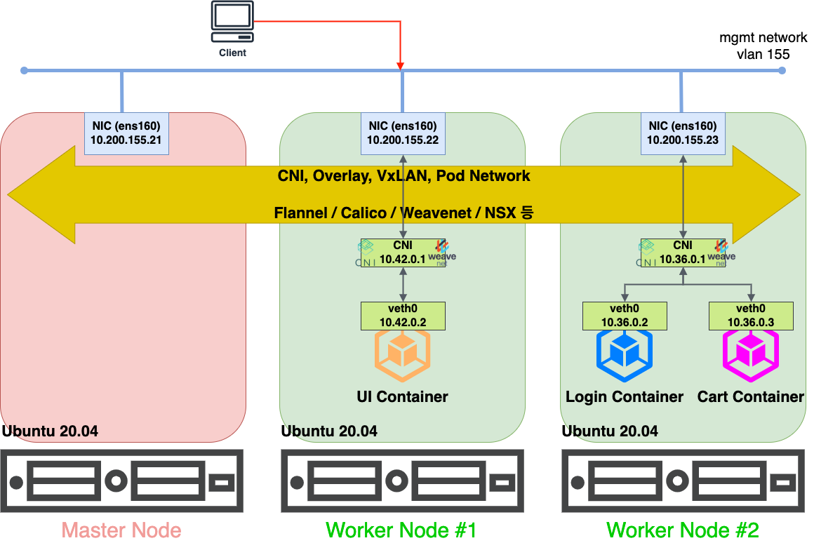

# Install

### CNI

CNI : Container Network Interface

VxLan, Pod Network 라고도 부름

VLan 의 extensible 이라는 뜻으로 VxLan 이다.
가상머신의 등장으로 필요한 mac address가 급격히 많아지면서 스위치에 table을 모아 놓는 것의 부담이 너무 커졌다. 그래서 각 가상머신이 알아서 가상 스위치를 만들어 관리하는 방식을 적용시켰다 (는 정도만 이해하자)

각각의 노드들 끼리 소통하기 위해서 필요한 것이 CNI이며, 그 많은 선택지들(Calico, Cilium, Flannel(default))이 내부 구조가 조금씩 다르다. 궁금하다면 아래 키워드에 대해 따로 공부해 보는 것이 좋을 것 같다.

- bridge
- NAT
- L2 Network

Calico의 경우 한 번 설치하면 그 cache 나 기록들이 깔끔하게 삭제되지 않아서 다음번 설치나 노드 실행 때 문제를 발생시켰었다.

신중하게 CNI를 선택해야 할 것 같다.



[이미지 출처](https://captcha.tistory.com/78)

## Docker

[docs docker](https://docs.docker.com/engine/install/ubuntu/)

- Docker-ce : 도커엔진

### install

```r
# conflicting package uninstall
for pkg in docker.io docker-doc docker-compose docker-compose-v2 podman-docker containerd runc; do sudo apt-get remove $pkg; done

# Add Docker's official GPG key:
sudo apt-get update
sudo apt-get install ca-certificates curl
sudo install -m 0755 -d /etc/apt/keyrings
sudo curl -fsSL https://download.docker.com/linux/ubuntu/gpg -o /etc/apt/keyrings/docker.asc
sudo chmod a+r /etc/apt/keyrings/docker.asc

# Add the repository to Apt sources:
echo \
  "deb [arch=$(dpkg --print-architecture) signed-by=/etc/apt/keyrings/docker.asc] https://download.docker.com/linux/ubuntu \
  $(. /etc/os-release && echo "$VERSION_CODENAME") stable" | \
  sudo tee /etc/apt/sources.list.d/docker.list > /dev/null
sudo apt-get update

# List the available versions:
apt-cache madison docker-ce | awk '{ print $3 }'

# 특정 버전 설치
VERSION_STRING=5:27.1.1-1~ubuntu.24.04~noble
sudo apt-get install docker-ce=$VERSION_STRING docker-ce-cli=$VERSION_STRING containerd.io docker-buildx-plugin docker-compose-plugin
```

### uninstall

```r
sudo apt-get purge docker-ce docker-ce-cli containerd.io docker-buildx-plugin docker-compose-plugin docker-ce-rootless-extras
sudo rm -rf /var/lib/docker
sudo rm -rf /var/lib/containerd
```

## Kubernetes

[kubernetes.io](https://kubernetes.io/docs/setup/production-environment/tools/kubeadm/install-kubeadm/)

### Prerequisite

머신 사양이 얼마나 중요한지 kubeflow 를 설치하면서 충분히 느꼈다.
kubeflow 최신 버전 (kind cluster 구성방식) 은 16 코어에 32GB RAM 을 필요로 했었다.
1.8 버전에서도 최소 4코어의 CPU를 필요로 해서 버전을 낮췄는데, 싸피에서 제공하는 EC2가 4코어 CPU라서 98%의 점유율을 보여줬다.

- 2 GB or more of RAM per machine (any less will leave little room for your apps).
- 2 CPUs or more for control plane machines.
- Full network connectivity between all machines in the cluster (public or private network is fine).
- Unique hostname, MAC address, and product_uuid for every node. See [here](https://kubernetes.io/docs/setup/production-environment/tools/kubeadm/install-kubeadm/#verify-mac-address) for more details.
- Certain ports are open on your machines. See [here](https://kubernetes.io/docs/setup/production-environment/tools/kubeadm/install-kubeadm/#check-required-ports) for more details.

  - 특히 **6443포트**는 열려 있어야 한다.

### swap 영역 해제

- `sudo swapoff -a`

### container runtime

| Runtime                           | Path to Unix domain socket                 |
| --------------------------------- | ------------------------------------------ |
| containerd                        | unix:///var/run/containerd/containerd.sock |
| CRI-O                             | unix:///var/run/crio/crio.sock             |
| Docker Engine (using cri-dockerd) | unix:///var/run/cri-dockerd.sock           |

### install

```r
sudo apt-get update
# apt-transport-https may be a dummy package; if so, you can skip that package
sudo apt-get install -y apt-transport-https ca-certificates curl gpg

# If the directory `/etc/apt/keyrings` does not exist, it should be created before the curl command, read the note below.
# sudo mkdir -p -m 755 /etc/apt/keyrings
curl -fsSL https://pkgs.k8s.io/core:/stable:/v1.31/deb/Release.key | sudo gpg --dearmor -o /etc/apt/keyrings/kubernetes-apt-keyring.gpg

# This overwrites any existing configuration in /etc/apt/sources.list.d/kubernetes.list
echo 'deb [signed-by=/etc/apt/keyrings/kubernetes-apt-keyring.gpg] https://pkgs.k8s.io/core:/stable:/v1.31/deb/ /' | sudo tee /etc/apt/sources.list.d/kubernetes.list

sudo apt-get update
sudo apt-get install -y kubelet kubeadm kubectl
sudo apt-mark hold kubelet kubeadm kubectl

sudo systemctl enable --now kubelet
```

#### bash auto-completion

[here](https://kubernetes.io/docs/tasks/tools/install-kubectl-linux/#enable-shell-autocompletion)

`echo 'source <(kubectl completion bash)' >>~/.bashrc`
