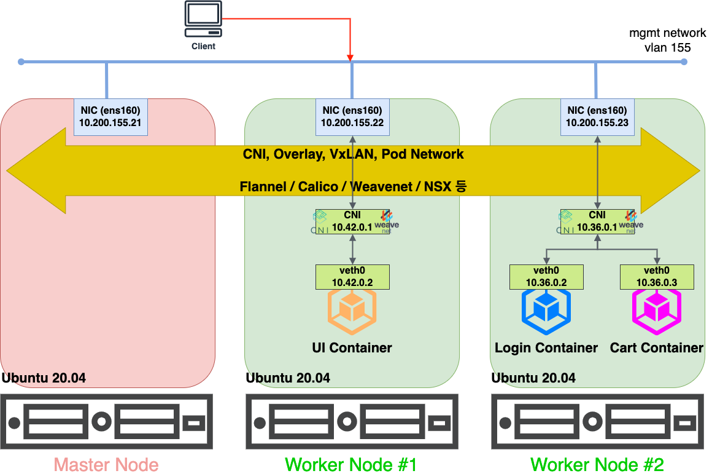

# Install

### CNI

CNI : Container Network Interface

VxLan, Pod Network 라고도 부름

VLan 의 extensible 이라는 뜻으로 VxLan 이다.
가상머신의 등장으로 필요한 mac address가 급격히 많아지면서 스위치에 table을 모아 놓는 것의 부담이 너무 커졌다. 그래서 각 가상머신이 알아서 가상 스위치를 만들어 관리하는 방식을 적용시켰다 (는 정도만 이해하자)

각각의 노드들 끼리 소통하기 위해서 필요한 것이 CNI이며, 그 많은 선택지들(Calico, Cilium, Flannel(default))이 내부 구조가 조금씩 다르다. 궁금하다면 아래 키워드에 대해 따로 공부해 보는 것이 좋을 것 같다.

- bridge
- NAT
- L2 Network

Calico의 경우 한 번 설치하면 그 cache 나 기록들이 깔끔하게 삭제되지 않아서 다음번 설치나 노드 실행 때 문제를 발생시켰었다.

신중하게 CNI를 선택해야 할 것 같다.



[이미지 출처](https://captcha.tistory.com/78)

## install

- Docker

[docs docker](https://docs.docker.com/engine/install/ubuntu/)

```r


```

- Kubernetes
